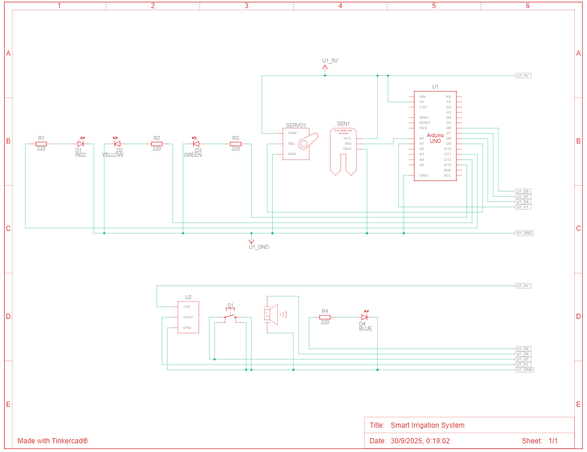
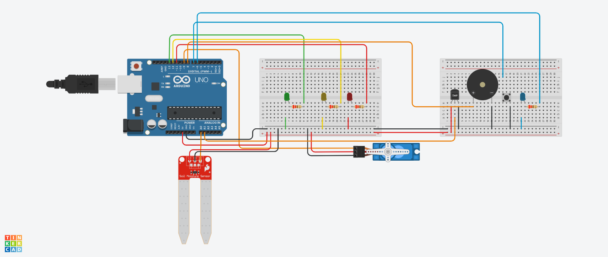

# Smart Irrigation System 🌱

## Problem

Plants require consistent and appropriate watering to survive and thrive, yet manual watering methods are unreliable and inefficient. The main problems include:

- **Inconsistent watering schedules** due to human forgetfulness or busy lifestyles
- **Inability to water plants** during vacations, business trips, or extended absences
- **Overwatering or underwatering** caused by guesswork rather than actual soil conditions
- **No adaptation to environmental conditions** such as temperature changes affecting plant water needs
- **Water waste** from unnecessary watering when soil is already moist
- **Plant stress or death** from dehydration during hot weather
- **Lack of real-time feedback** on soil and environmental conditions
- **No emergency override** when manual intervention is necessary

These issues result in unhealthy plants, wasted water resources, and frustrated gardeners who want a more reliable solution.

## Design

The Smart Irrigation System is an Arduino-based automated solution that combines multiple sensors with intelligent control logic to provide optimal plant care.

### System Architecture

**Input Sensors:**
- **Soil Moisture Sensor**: Continuously monitors soil humidity levels through analog readings (0-1023 scale)
- **TMP36 Temperature Sensor**: Measures ambient temperature to adapt watering schedules
- **Pushbutton**: Allows manual override for emergency or supplemental watering

**Control Logic:**
- **Adaptive Thresholds**: System adjusts moisture thresholds based on temperature
  - Normal conditions: Dry (<400), Medium (400-700), Wet (>700)
  - Hot conditions (>25°C): Adjusted for more frequent watering - Dry (<500), Medium (500-750), Wet (>750)
- **Automatic Mode**: Continuously monitors and waters based on sensor readings
- **Manual Mode**: Button press triggers immediate watering regardless of moisture level
- **Temperature Alerts**: Buzzer activates when temperature exceeds 30°C (every 3 seconds)

**Output Actuators:**
- **Servo Motor**: Simulates water pump, activates for 2-second watering cycles
- **LED Indicators**: Four-color visual feedback system
  - Green: Soil is wet, no watering needed
  - Yellow: Soil has medium moisture
  - Red: Soil is dry, watering active
  - Blue: Manual mode engaged
- **Piezo Buzzer**: Audio alerts for high temperature conditions

**Processing:**
- Arduino Uno microcontroller runs control algorithm
- 500ms update cycle for responsive operation
- Real-time threshold calculation based on temperature

## Parts List

| Component | Quantity | Purpose |
|-----------|----------|---------------|---------|
| Arduino Uno R3 | 1 | Main microcontroller |
| Soil Moisture Sensor | 1 | Detects soil humidity |
| TMP36 Temperature Sensor | 1 | Monitors ambient temperature |
| Micro Servo SG90 | 1 | Simulates water pump |
| LED - Green | 1 | Wet soil indicator |
| LED - Yellow | 1 | Medium moisture indicator |
| LED - Red | 1 | Dry soil indicator |
| LED - Blue | 1 | Manual mode indicator |
| Piezo Buzzer | 1 | Temperature alert audio |
| Pushbutton | 1 | Manual watering trigger |
| Resistor 220Ω | 4 | LED current limiting |
| Breadboard | 2 | Circuit assembly |
| Jumper Wires | 25 | Component connections |
| USB Cable | 1 | Arduino power and programming |

## Wiring Diagram / Photo / Schematic

### Circuit Connections

**Soil Moisture Sensor:**
- VCC → 5V (via breadboard power rail)
- GND → Ground (via breadboard ground rail)
- A0 → Arduino Pin A0

**TMP36 Temperature Sensor:**
- Left pin (Vs) → 5V (via breadboard power rail)
- Center pin (Vout) → Arduino Pin A1
- Right pin (GND) → Ground (via breadboard ground rail)

**Servo Motor:**
- Red wire → 5V (via breadboard power rail)
- Brown/Black wire → Ground (via breadboard ground rail)
- Orange wire → Arduino Pin 9

**LED Connections (all with 220Ω resistors):**
- Green LED: Arduino Pin 13 → Resistor → LED Anode, LED Cathode → Ground
- Yellow LED: Arduino Pin 12 → Resistor → LED Anode, LED Cathode → Ground
- Red LED: Arduino Pin 11 → Resistor → LED Anode, LED Cathode → Ground
- Blue LED: Arduino Pin 6 → Resistor → LED Anode, LED Cathode → Ground

**Piezo Buzzer:**
- Positive terminal → Arduino Pin 8
- Negative terminal → Ground (via breadboard ground rail)

**Pushbutton:**
- Terminal 1 → Arduino Pin 7
- Terminal 2 (diagonal opposite) → Ground (via breadboard ground rail)
- Internal pull-up resistor enabled in code (INPUT_PULLUP)

**Power Distribution:**
- Arduino 5V pin → Breadboard positive rail (red)
- Arduino GND pin → Breadboard ground rail (blue/black)

### Photo

 | 

## What Works / What Didn't

### What Works ✅

**Moisture Sensing System:**
- Soil moisture sensor provides accurate and stable analog readings
- System correctly differentiates between wet, medium, and dry soil conditions
- Threshold-based logic reliably triggers watering at appropriate times
- LED indicators clearly show current moisture status

**Temperature Monitoring:**
- TMP36 sensor accurately measures ambient temperature
- Voltage-to-Celsius conversion formula works correctly
- Adaptive threshold system successfully adjusts watering frequency during hot conditions
- Temperature alerts activate properly when threshold exceeded

**Automatic Irrigation:**
- Servo motor consistently activates for precise 2-second watering cycles
- System automatically maintains optimal soil moisture without user intervention
- Adaptive logic prevents underwatering during high temperature periods
- Quick response time (500ms update cycle) ensures timely watering

**Manual Control:**
- Pushbutton reliably triggers manual watering mode
- Blue LED clearly indicates when manual mode is active
- Button debouncing prevents false triggering
- Manual override works independently of automatic system

**Visual Feedback:**
- All four LEDs function correctly with appropriate current limiting
- Color-coded system is intuitive and easy to understand
- LEDs provide immediate status information at a glance

**Audio Alerts:**
- Buzzer produces clear, audible tones for temperature warnings
- Alert interval (3 seconds) is appropriate - frequent enough without being annoying
- Dual-tone pattern is distinctive and attention-getting

**Power Management:**
- System operates reliably on USB power (5V)
- All components function within voltage/current specifications
- No overheating or power stability issues

### What Didn't Work / Challenges ❌

**Startup Behavior:**
- System initially triggered false button press at startup
- Issue: Button state not properly initialized before main loop
- Solution: Added initialization delay and proper button state reading in setup()

**Sensor Stabilization:**
- First readings at startup were sometimes unstable
- Solution: Added 2-second delay in setup() for sensor stabilization
- Improvement: Ensures accurate readings from the first measurement cycle

**Temperature Threshold Tuning:**
- Had to adjust temperature alert threshold through testing
- Initial setting was too sensitive, triggering alerts frequently
- Solution: Set threshold at 30°C for realistic high-temperature detection

**Code Complexity:**
- Managing multiple sensors and outputs required careful variable tracking
- Solution: Used clear naming conventions and comments
- Improvement: Modular function design (manualWatering(), temperatureAlarm())

## Future Improvements

1. **Water Level Detection**
   - Add ultrasonic sensor (HC-SR04) to monitor water reservoir level
   - System pauses irrigation and alerts user when water runs low
   - Prevents pump from running dry

2. **SD Card Data Logging**
   - Log moisture, temperature, and watering events to SD card
   - Create historical data for analysis and optimization
   - Track plant health trends over weeks/months

3. **Weather API Integration**
    - Connect to online weather services
    - Adjust watering based on rainfall predictions
    - Reduce watering before expected rain events
    - Temperature forecasts for proactive adaptation

4. **Machine Learning Optimization**
    - Collect long-term data on plant health vs. watering patterns
    - Use ML algorithms to optimize watering schedules
    - Predictive watering based on historical patterns
    - Continuous improvement through learning

5. **Automated Fertilizer Injection**
    - Add nutrient solution reservoir with controlled dispensing
    - Schedule-based or sensor-triggered fertilization
    - Complete automated plant care system
    - pH-adjusted nutrient delivery

## Conclusion

The Smart Irrigation System successfully demonstrates practical Arduino-based automation for solving real-world problems. The integration of moisture sensing, temperature monitoring, adaptive control logic, and manual override creates a robust and flexible plant care solution. Despite some initial challenges with component configuration and startup behavior, the final system operates reliably and efficiently. The modular design provides an excellent foundation for future enhancements, making this project both a functional tool and an educational platform for embedded systems development.